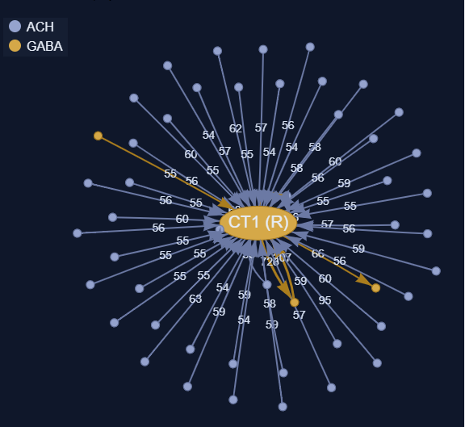
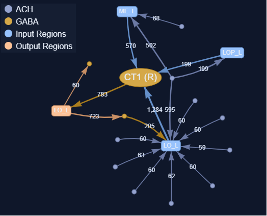
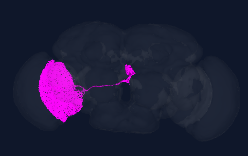

# Scientific Summary: A CT1-Centric Optic-Lobe Motion Ensemble (FAFB)

**Dataset:** FAFB (v783) · **Correspondence:** FAFB / MCNS / MAOL · **N = 2,563 · 2,586 induced edges**

## Context

The challenge requires the largest mutually isomorphic directed induced subgraph across three connectomes. Our solution (`network.csv`) uses deterministic construction around dataset-specific hubs ([README](README.md)). Here we investigate the **biological significance of the FAFB projection** of that correspondence.

## Biological identity in FAFB

Codex `consolidated_cell_types` annotates all 2,563 circuit neurons:

| Role (rows) | n | Dominant FAFB types |
| :--- | ---: | :--- |
| Hub (0) | 1 | **CT1** |
| Out / depth-2 parents (1–1854) | 1,854 | **T4/T5 subtypes** (~97%) |
| In leaves (1855–1883) | 29 | T4d/c, Mi9, Tm1, Mi10 |
| Bi leaves (1884–1907) | 24 | Mixed T4a/b, T5a/d/c |
| Depth-2 children (1908–2562) | 655 | **Tm4** (26%), **Tm3** (20%), **Mi4** (16%), **Mi9** (12%) |

**74% of non-hub neurons are T4 or T5** — direction-selective columnar outputs of the ON/OFF motion pathways. The remainder are predominantly **Tm** (transmedullary) and **Mi** (medulla intrinsic) interneurons, the canonical presynaptic partners of T4/T5. The hub is **CT1**, the sole centrifugal tangential neuron innervating medulla M10 and lobula Lo1, where T4/T5 form motion-sensitive columnar terminals.

*Note: the cell-type table above is a Codex lookup over the FAFB neuron IDs in `network.csv` and should be re-verified against the live Codex annotations before final submission.*

## Structural and functional observations

**Topology (algorithmic).** The subgraph is a hub-and-spoke core (hub → 1,854 out-leaves; 29 in-leaves → hub; 24 bi-leaves ↔ hub) plus 655 depth-2 chains (child → parent). This topology was *constructed* to guarantee isomorphism; it is not a claim of a single anatomically isolated module.

**Composition (biological).** The FAFB neuron set is nonetheless strongly enriched for optic-lobe motion circuitry. Greedy independent-set selection around CT1 yields columnar leaves without leaf-leaf edges — consistent with T4/T5 neurons sharing a tangential partner but not synapsing onto each other in this neighborhood. Depth-2 children (Tm/Mi types) match known T4/T5 input cell classes.

Directional selectivity in T4 (ON) and T5 (OFF) emerges in their dendrites via integration of **Mi1/Tm3** (excitatory) and **Mi4/Mi9/C3/CT1** (modulatory/inhibitory) inputs (Takemura et al., 2017; Strother et al., 2017). CT1 receives motion-interneuron input (notably from Tm9) and provides wide-field feedback onto T4/T5 null sides (Shinomiya et al., 2019; Matsliah et al., 2024). Our FAFB correspondence therefore maps onto a **CT1-anchored motion-column ensemble**: T4/T5 outputs, their presynaptic Tm/Mi partners, and CT1-associated connectivity motifs.

## Hypothesis

The FAFB projection captures a **conserved optic-lobe motion-processing neighborhood** — stereotyped columnar circuitry and CT1 feedback repeated across brains — rather than an arbitrary mixed-brain subgraph. Cross-dataset isomorphism (FAFB/MCNS/MAOL) may reflect this stereotypy even though neuron IDs differ and regional matching was not required. Depth-2 extensions enlarge *N* topologically; biologically, they assign known T4/T5 input types as peripheral nodes. A follow-up is to test whether child → parent pairs recapitulate established synapse motifs (e.g., Mi9 → T4, Tm4 → T5) at scale in FAFB.

## Visualizations (Codex)

*(The images below are generated from the FAFB dataset via FlyWire Codex, capturing the CT1 (R) hub neuron ID `720575940628908548`)*

**1. The Hub-Centered Star Topology (Network Graph):**

*Figure 1: Node-level network graph of the CT1 (R) hub neuron. This visualizes the algorithmic core of our approach: anchoring the graph on a central hub and branching out to an independent set of leaf nodes to guarantee structural isomorphism.*

---

**2. Regional Connectivity:**

*Figure 2: Region-level network graph detailing the top connections by synapse count. Note the massive connectivity to the Lobula (LO_L) and Medulla (ME_L), supporting our motion-ensemble hypothesis.*

---

**3. 3D Mesh Visualization:**

*Figure 3: 3D mesh rendering of the CT1 (R) neuron. The physical structure confirms it is a wide-field tangential neuron spanning large portions of the optic lobe.*

---

**Live Interactive Links:**
Sign in at [codex.flywire.ai](https://codex.flywire.ai) to explore interactively:
1. **Hub 3D mesh (CT1):** [FAFB 720575940628908548](https://codex.flywire.ai/app/cell_details?dataset=fafb&cell_names_or_id=720575940628908548)
2. **Network graph:** [Connectivity — CT1 neighborhood](https://codex.flywire.ai/app/connectivity?dataset=fafb&cell_names_or_ids=720575940628908548), or upload all FAFB IDs from `network.csv` via **List → Upload** for the full 2,563-node graph and 3D scene.

## References

1. Matsliah et al. Neuronal parts list and wiring diagram for a visual system. *Nature* (2024). [doi:10.1038/s41586-024-07981-1](https://doi.org/10.1038/s41586-024-07981-1)
2. Shinomiya et al. The organization of the second optic chiasm of the Drosophila optic lobe. *Front. Neural Circuits* (2019). [doi:10.3389/fncir.2019.00065](https://doi.org/10.3389/fncir.2019.00065)
3. Takemura et al. The comprehensive connectome of a neural substrate for 'ON' motion detection in Drosophila. *eLife* (2017). [doi:10.7554/eLife.24394](https://doi.org/10.7554/eLife.24394)
4. Strother et al. The emergence of directional selectivity in the visual motion pathway of Drosophila. *Neuron* (2017). [doi:10.1016/j.neuron.2017.03.010](https://doi.org/10.1016/j.neuron.2017.03.010)
5. Schlegel et al. Whole-brain annotation and multi-connectome cell typing of Drosophila. *Nature* (2024). [doi:10.1038/s41586-024-07686-5](https://doi.org/10.1038/s41586-024-07686-5)
6. Dorkenwald et al. Neuronal wiring diagram of an adult brain. *Nature* (2024). [doi:10.1038/s41586-024-07558-y](https://doi.org/10.1038/s41586-024-07558-y)
